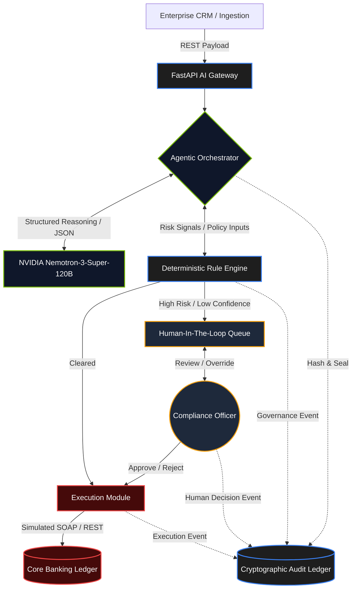
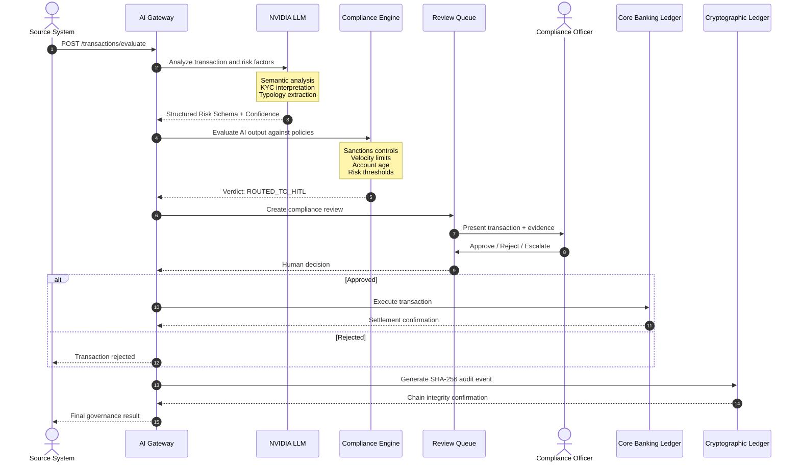

# 🛡️ GovAI-Nexus: Enterprise Agentic Governance OS

**Intelligent Orchestration • Deterministic Governance • Cryptographic Auditability • Human-in-the-Loop Compliance**

[](https://github.com/)
[](https://www.python.org/)
[](https://fastapi.tiangolo.com/)
[](https://www.nvidia.com/)
[](#security--governance)

> ⚠️ **CLASSIFICATION: CONFIDENTIAL // PROPRIETARY**
>
> This repository contains the core logic for the GovAI-Nexus Enterprise Governance Platform. Unauthorized distribution, modification, or deployment outside designated secure environments is strictly prohibited.

---

# 📑 System Overview

**GovAI-Nexus** is an enterprise-grade **Agentic Governance and Compliance Operating System** designed to establish a controlled security boundary between autonomous AI agents and financial transaction infrastructure.

The platform combines:

* **Agentic AI orchestration**
* **Large Language Model reasoning**
* **Deterministic compliance enforcement**
* **AML/KYC risk analysis**
* **Human-in-the-Loop decision governance**
* **Cryptographic audit trails**
* **Immutable-style WORM event chaining**
* **Transaction execution controls**
* **Security and policy enforcement**

GovAI-Nexus follows a fundamental governance principle:

> **AI may recommend. Deterministic governance may constrain. Humans may authorize. The audit layer records everything.**

The system is designed so that semantic reasoning performed by an LLM does not independently become the final authority for sensitive financial operations.

Instead, AI-generated intelligence is passed through deterministic governance controls before execution.

---

# 🎯 Design Objectives

GovAI-Nexus is built around six primary objectives:

### 1. AI-Assisted Decision Intelligence

Use high-parameter LLMs to interpret complex transaction and KYC information, extract relevant risk indicators, and identify potentially suspicious behavioral patterns.

### 2. Deterministic Governance

Enforce hard compliance constraints independently from probabilistic model reasoning.

Examples include:

* Sanctions screening
* OFAC-related controls
* UN sanctions controls
* Transaction velocity limits
* Account-age restrictions
* Risk thresholds
* Transaction amount thresholds
* Mandatory escalation conditions

### 3. Human Oversight

Automatically route uncertain, high-risk, or policy-sensitive decisions to authorized compliance personnel.

### 4. Cryptographic Auditability

Record AI decisions, deterministic evaluations, human interventions, and execution events through chained cryptographic hashes.

### 5. Controlled Transaction Execution

Prevent autonomous AI reasoning from directly bypassing governance controls before a transaction reaches the execution layer.

### 6. Enterprise Observability

Provide visibility into:

* AI decisions
* Risk scores
* Confidence scores
* Governance decisions
* HITL escalations
* Human overrides
* Transaction execution
* Audit-chain integrity

---

# 🏛️ Core Governance Model

GovAI-Nexus separates **reasoning**, **governance**, **authorization**, and **execution**.

```text
                 ┌───────────────────────────┐
                 │     External Systems      │
                 │ CRM / Banking / KYC       │
                 └─────────────┬─────────────┘
                               │
                               ▼
                 ┌───────────────────────────┐
                 │      Secure API Gateway   │
                 │         FastAPI           │
                 └─────────────┬─────────────┘
                               │
                               ▼
                 ┌───────────────────────────┐
                 │    Agentic Orchestrator   │
                 └─────────────┬─────────────┘
                               │
                    ┌──────────┴──────────┐
                    ▼                     ▼
          ┌──────────────────┐   ┌─────────────────────┐
          │   AI Reasoning   │   │ Deterministic       │
          │ NVIDIA Nemotron  │   │ Governance Engine   │
          └────────┬─────────┘   └──────────┬──────────┘
                   │                        │
                   └──────────┬─────────────┘
                              ▼
                 ┌───────────────────────────┐
                 │    Governance Decision    │
                 └─────────────┬─────────────┘
                               │
              ┌────────────────┼────────────────┐
              │                │                │
              ▼                ▼                ▼
          APPROVE            HITL             REJECT
              │                │
              │                ▼
              │       ┌──────────────────┐
              │       │ Compliance       │
              │       │ Officer Review   │
              │       └────────┬─────────┘
              │                │
              └────────┬───────┘
                       ▼
              ┌────────────────────┐
              │ Execution Module   │
              └─────────┬──────────┘
                        ▼
              ┌────────────────────┐
              │ Core Banking       │
              │ Ledger             │
              └────────────────────┘

       Every decision ───────────────► Cryptographic Audit Ledger
```

---

# 🧠 Core Pillars

## 🤖 1. AI Orchestrator

The AI Orchestrator acts as the semantic reasoning layer.

It routes structured financial and KYC information to the configured LLM and converts unstructured information into structured risk intelligence.

Responsibilities include:

* Transaction interpretation
* KYC profile analysis
* Entity extraction
* Risk-factor extraction
* Suspicious behavioral pattern identification
* FATF typology identification
* Semantic reasoning
* Confidence estimation
* Structured JSON generation

The AI layer is intentionally separated from deterministic policy enforcement.

---

# ⚖️ 2. Deterministic Governance Engine

The Governance Engine represents the hard-policy boundary of the platform.

AI-generated recommendations are evaluated against deterministic rules before execution.

Example controls include:

```text
Sanctions Match
      │
      ├── MATCH ─────────────► REJECT
      │
      └── NO MATCH

Transaction Velocity
      │
      ├── LIMIT EXCEEDED ────► HITL / REJECT
      │
      └── WITHIN LIMIT

Risk Score
      │
      ├── HIGH ──────────────► HITL
      ├── MEDIUM ────────────► REVIEW
      └── LOW ───────────────► CONTINUE
```

The deterministic governance layer is designed to constrain the AI rather than allow the AI to redefine the governing policy.

---

# 🕵️ 3. Human-in-the-Loop Governance

Not every decision should be autonomously executed.

GovAI-Nexus introduces explicit escalation paths for:

* High-risk transactions
* Low-confidence AI decisions
* Policy conflicts
* Sanctions-related alerts
* Unusual transaction behavior
* Threshold violations
* AI/governance disagreement
* Sensitive compliance decisions

The resulting workflow becomes:

```text
AI Analysis
     │
     ▼
Governance Evaluation
     │
     ├── Low Risk ─────────────► Execution
     │
     ├── High Risk ────────────► HITL
     │
     ├── Low Confidence ───────► HITL
     │
     └── Policy Violation ─────► Reject
```

Human officers can review the evidence, provide a decision, and generate an auditable override event.

---

# ⛓️ 4. Cryptographic Audit Ledger

GovAI-Nexus implements a chained audit architecture based on **SHA-256 cryptographic hashing**.

Each event incorporates the hash of the preceding event.

Conceptually:

```text
Event N-2
   │
   ▼
SHA-256
   │
   ▼
Event N-1
   │
   ▼
SHA-256
   │
   ▼
Event N
```

Each audit event can contain information such as:

```json
{
  "event_id": "AUD-8923",
  "event_type": "AI_DECISION",
  "actor": "AI_ORCHESTRATOR",
  "transaction_id": "TXN-00192",
  "decision": "ROUTED_TO_HITL",
  "risk_score": 0.885,
  "previous_hash": "....",
  "event_hash": "....",
  "timestamp": "...."
}
```

If historical data is modified without correctly rebuilding the chain, subsequent integrity verification can detect the inconsistency.

> **Note:** Cryptographic hash chaining provides tamper-evidence. It does not by itself constitute a physically immutable storage medium. Production deployments should combine the application-level chain with appropriate WORM/object-lock storage and access controls where regulatory immutability requirements apply.

---

# 🏗️ System Architecture



---

# 🔄 Decision Execution Flow

The following sequence demonstrates how GovAI-Nexus processes a high-value transaction.



---

# 🔐 Governance Boundary

One of the central design principles of GovAI-Nexus is that **LLM output is treated as untrusted decision intelligence rather than an unrestricted authority**.

```text
                 ┌──────────────────────────────┐
                 │       LLM Reasoning          │
                 │                              │
                 │  Probabilistic               │
                 │  Semantic                   │
                 │  Contextual                 │
                 └──────────────┬───────────────┘
                                │
                                │ Untrusted AI Output
                                ▼
                 ┌──────────────────────────────┐
                 │   Schema Validation Layer    │
                 └──────────────┬───────────────┘
                                │
                                ▼
                 ┌──────────────────────────────┐
                 │ Deterministic Governance     │
                 │                              │
                 │ Sanctions                   │
                 │ Velocity                    │
                 │ Risk Thresholds             │
                 │ Account Policies             │
                 └──────────────┬───────────────┘
                                │
                    ┌───────────┴───────────┐
                    ▼                       ▼
                 EXECUTE                   HITL
                                            │
                                            ▼
                                   Human Authorization
```

This separation reduces the risk of allowing an LLM to directly redefine or bypass deterministic compliance controls.

---

# 🧩 Decision State Machine

```text
                 ┌─────────────┐
                 │   RECEIVED  │
                 └──────┬──────┘
                        │
                        ▼
                 ┌─────────────┐
                 │ AI ANALYSIS │
                 └──────┬──────┘
                        │
                        ▼
              ┌────────────────────┐
              │ GOVERNANCE ENGINE  │
              └─────────┬──────────┘
                        │
          ┌─────────────┼──────────────┐
          │             │              │
          ▼             ▼              ▼
       APPROVE         HITL          REJECT
          │             │              │
          │             ▼              │
          │        HUMAN REVIEW        │
          │             │              │
          │       ┌─────┴─────┐        │
          │       ▼           ▼        │
          │    APPROVE      REJECT     │
          │       │           │        │
          └───────┘           └────────┘
                  │
                  ▼
            ┌────────────┐
            │  EXECUTE   │
            └─────┬──────┘
                  │
                  ▼
            ┌────────────┐
            │   AUDIT    │
            └────────────┘
```

---

# ⚙️ Technology Stack

| Domain                | Technologies                                          |
| --------------------- | ----------------------------------------------------- |
| **Core Backend**      | Python 3.11, FastAPI, Pydantic, Uvicorn               |
| **AI / LLM**          | LangChain, NVIDIA AI Endpoints, Nemotron-3-Super-120B |
| **Database**          | SQLite for local development                          |
| **ORM**               | SQLAlchemy 2.0 Async                                  |
| **Migrations**        | Alembic                                               |
| **Caching / Limits**  | Redis, Circuit Breakers, Sliding Window Rate Limiting |
| **Authentication**    | JWT / HS256                                           |
| **Password Security** | PBKDF2                                                |
| **Audit Security**    | SHA-256 Cryptographic Hash Chaining                   |
| **Frontend**          | Vanilla JavaScript                                    |
| **Styling**           | TailwindCSS                                           |
| **Visualization**     | Chart.js                                              |
| **API Architecture**  | REST                                                  |
| **Integration Model** | REST / simulated SOAP                                 |
| **Governance**        | Deterministic Rule Engine + HITL                      |

---

# 🛡️ Security Architecture

GovAI-Nexus applies multiple security boundaries rather than relying on the LLM alone.

## Authentication

JWT-based authentication is used for protected API access.

```text
Client
  │
  ▼
JWT Authentication
  │
  ├── Invalid ─────► 401
  │
  └── Valid
        │
        ▼
    API Gateway
```

---

## Password Protection

User credentials are protected using PBKDF2-based password hashing rather than storing plaintext passwords.

---

## Rate Limiting

Redis can be used for:

* Sliding-window rate limiting
* Request throttling
* Circuit breakers
* Abuse protection
* Service protection

---

## Cryptographic Audit

Each governance event can be linked to the previous event:

```text
HASH(Event N) =
SHA256(
    Event N Data
    +
    HASH(Event N-1)
)
```

This produces a tamper-evident chain.

---

# 📊 Governance Telemetry

The platform can expose operational and compliance telemetry including:

### AI Metrics

* Risk score
* Confidence score
* Model response latency
* AI decision
* Extracted typologies
* Model metadata

### Governance Metrics

* Rules triggered
* Sanctions checks
* Velocity checks
* Policy violations
* Governance verdict
* Escalation rate

### HITL Metrics

* Pending reviews
* Review latency
* Approval rate
* Rejection rate
* Human override rate

### Audit Metrics

* Event count
* Chain verification status
* Hash mismatches
* Audit integrity failures

---

# 🧪 Example Governance Scenario

Consider a high-value transaction:

```text
Transaction
    │
    ▼
AI Analysis
    │
    ├── Risk Score: 0.885
    ├── Confidence: 0.71
    └── Typology: Potential TBML
    │
    ▼
Deterministic Governance
    │
    ├── Sanctions: CLEAR
    ├── Velocity: WARNING
    ├── Account Age: CLEAR
    └── Risk Threshold: HIGH
    │
    ▼
HITL
    │
    ▼
Compliance Officer
    │
    ├── APPROVE
    │
    └── REJECT
    │
    ▼
Execution
    │
    ▼
Cryptographic Audit Event
```

The key design property is that the AI does not independently bypass the governance boundary.

---

# 🚀 Getting Started

## 1. Clone the Repository

```bash
git clone https://github.com/NukaNarendra/GovAI-Nexus.git
cd GovAI-Nexus
```

---

# 2. Backend Setup

Navigate to the backend:

```bash
cd backend_api
```

Create a virtual environment:

```bash
python -m venv my_env
```

### Windows

```powershell
.\my_env\Scripts\activate
```

### macOS / Linux

```bash
source my_env/bin/activate
```

Install dependencies:

```bash
pip install -r requirements.txt
```

---

# 3. Configure Environment Variables

Copy the example configuration:

```bash
cp .env.example .env
```

Then configure the required credentials.

Example:

```env
NVIDIA_API_KEY=your_nvidia_api_key

JWT_SECRET_KEY=change_this_in_production

DATABASE_URL=sqlite+aiosqlite:///./nexus.db

REDIS_URL=redis://localhost:6379
```

> ⚠️ Never commit `.env` files or production credentials to version control.

---

# 4. Database Initialization

Run migrations:

```bash
alembic upgrade head
```

Seed development data:

```bash
python seed.py
```

Add mock governance tasks:

```bash
python add_mock_tasks.py
```

---

# 5. Start the Backend

```bash
uvicorn src.main:app --reload --port 8000
```

The backend will be available at:

```text
http://localhost:8000
```

FastAPI documentation:

```text
http://localhost:8000/docs
```

---

# 6. Start the Frontend

Navigate to the frontend:

```bash
cd frontend_ui
```

Start the local server:

```bash
python serve.py
```

Open:

```text
http://localhost:4000
```

---

# 🔑 Development Credentials

For the local mock environment:

```text
Email:
admin@nexus.local

Password:
Admin123!
```

> ⚠️ These credentials are intended strictly for local development/demo environments. Replace or remove them before any production deployment.

---

# 🔌 Example API Flow

## Evaluate Transaction

```http
POST /api/v1/transactions/evaluate
Content-Type: application/json
Authorization: Bearer <JWT>
```

Example payload:

```json
{
  "transaction_id": "TXN-00192",
  "amount": 500000,
  "currency": "USD",
  "account_age_days": 42,
  "customer_risk": "HIGH",
  "destination_country": "EXAMPLE"
}
```

Example conceptual response:

```json
{
  "transaction_id": "TXN-00192",
  "decision": "ROUTED_TO_HITL",
  "risk_score": 0.885,
  "confidence": 0.71,
  "reason": [
    "High transaction risk",
    "Velocity threshold warning",
    "Additional human review required"
  ]
}
```

---

# ⛓️ Audit Chain Verification

The platform exposes an audit verification endpoint:

```http
GET /api/v1/audit/verify-chain
```

Conceptually:

```json
{
  "status": "VALID",
  "events_verified": 8923,
  "chain_integrity": true
}
```

If an event has been modified without updating the chain correctly:

```json
{
  "status": "INVALID",
  "chain_integrity": false,
  "broken_at": "AUD-8921"
}
```

---

# 🧠 Architectural Principle

GovAI-Nexus follows a layered decision model:

```text
┌─────────────────────────────────────┐
│             HUMAN LAYER             │
│     Authorization / Accountability  │
└──────────────────┬──────────────────┘
                   │
┌──────────────────▼──────────────────┐
│        GOVERNANCE LAYER             │
│ Rules / Policies / Thresholds       │
└──────────────────┬──────────────────┘
                   │
┌──────────────────▼──────────────────┐
│          AI REASONING LAYER         │
│ Semantic Analysis / Risk Extraction │
└──────────────────┬──────────────────┘
                   │
┌──────────────────▼──────────────────┐
│       DATA / INTEGRATION LAYER      │
│ APIs / KYC / Transactions / CRM     │
└─────────────────────────────────────┘
```

This separation is fundamental to the architecture.

---

# 🔬 Research & Engineering Focus

GovAI-Nexus explores the intersection of:

* Agentic AI
* AI Governance
* AI Security
* LLM Security
* Financial AI
* Compliance Automation
* AML/KYC
* Human-in-the-Loop Systems
* Deterministic AI Governance
* Cryptographic Auditability
* AI Risk Management
* Enterprise AI Architecture
* Autonomous Decision Systems
* AI Safety
* Responsible Agentic Systems

---

# 🧱 Production Hardening Roadmap

The current architecture is designed as an extensible foundation.

Potential production extensions include:

### Identity & Access

* OAuth2 / OIDC
* RBAC
* ABAC
* Hardware-backed credentials
* Service identities
* mTLS

### Governance

* Policy-as-code
* Versioned compliance policies
* Policy simulation
* Explainability
* Decision provenance
* Approval workflows

### Audit

* External WORM storage
* Object Lock
* Merkle-tree aggregation
* External timestamping
* SIEM integration
* Independent audit verification

### AI Security

* Prompt-injection protection
* Tool authorization
* Structured output validation
* Model isolation
* LLM gateway
* Adversarial evaluation
* Model behavior monitoring

### Enterprise Infrastructure

* PostgreSQL
* Redis Cluster
* Kafka
* Kubernetes
* Service mesh
* Secrets management
* Centralized observability

---

# 📁 Project Structure

```text
GovAI-Nexus/
│
├── backend_api/
│   │
│   ├── src/
│   │   ├── api/
│   │   ├── agents/
│   │   ├── auth/
│   │   ├── compliance/
│   │   ├── governance/
│   │   ├── models/
│   │   ├── schemas/
│   │   ├── services/
│   │   ├── audit/
│   │   └── main.py
│   │
│   ├── alembic/
│   ├── requirements.txt
│   ├── seed.py
│   └── add_mock_tasks.py
│
├── frontend_ui/
│   ├── index.html
│   ├── dashboard.html
│   ├── js/
│   ├── css/
│   └── serve.py
│
├── docs/
│   ├── architecture/
│   ├── governance/
│   └── security/
│
├── tests/
│   ├── unit/
│   ├── integration/
│   └── security/
│
├── .env.example
├── .gitignore
├── README.md
└── LICENSE
```

---

# 🛡️ Security & Governance

GovAI-Nexus should be treated as a security-sensitive research and engineering platform.

The architecture is designed around:

```text
AI Reasoning
      ↓
Schema Validation
      ↓
Deterministic Governance
      ↓
Human Authorization
      ↓
Controlled Execution
      ↓
Cryptographic Audit
```

No individual layer is assumed to be sufficient on its own.

---

# ⚠️ Security Disclaimer

GovAI-Nexus is an experimental enterprise AI governance platform intended for research, development, demonstration, and controlled environments.

The platform does **not** constitute legal, regulatory, financial, AML, KYC, sanctions, or compliance advice.

Production financial deployments require appropriate:

* Regulatory review
* Security assessment
* Compliance validation
* Penetration testing
* Infrastructure hardening
* Access-control review
* Data-protection controls
* Operational monitoring
* Disaster recovery
* Independent audit

The example policies and mock transaction data included in this repository must not be treated as production compliance rules.

---

# 📜 License

MIT License

Copyright (c) 2026 Nuka Venkata Narendra

Permission is hereby granted, free of charge, to any person obtaining a copy of this software and associated documentation files (the "Software"), to deal in the Software without restriction, including without limitation the rights to use, copy, modify, merge, publish, distribute, sublicense, and/or sell copies of the Software, subject to the following conditions:

The above copyright notice and this permission notice shall be included in all copies or substantial portions of the Software.

THE SOFTWARE IS PROVIDED "AS IS", WITHOUT WARRANTY OF ANY KIND, EXPRESS OR IMPLIED, INCLUDING BUT NOT LIMITED TO THE WARRANTIES OF MERCHANTABILITY, FITNESS FOR A PARTICULAR PURPOSE AND NONINFRINGEMENT.

---

# 👨‍💻 Author

**Nuka Venkata Narendra**

AI Systems • Agentic AI • AI Security • LLM Security • Enterprise AI Governance

---

# ⭐ Project Vision

> **GovAI-Nexus is designed to move enterprise AI from autonomous execution toward governed autonomy — where intelligence, policy, human accountability, and cryptographic evidence operate together as one system.**

---
